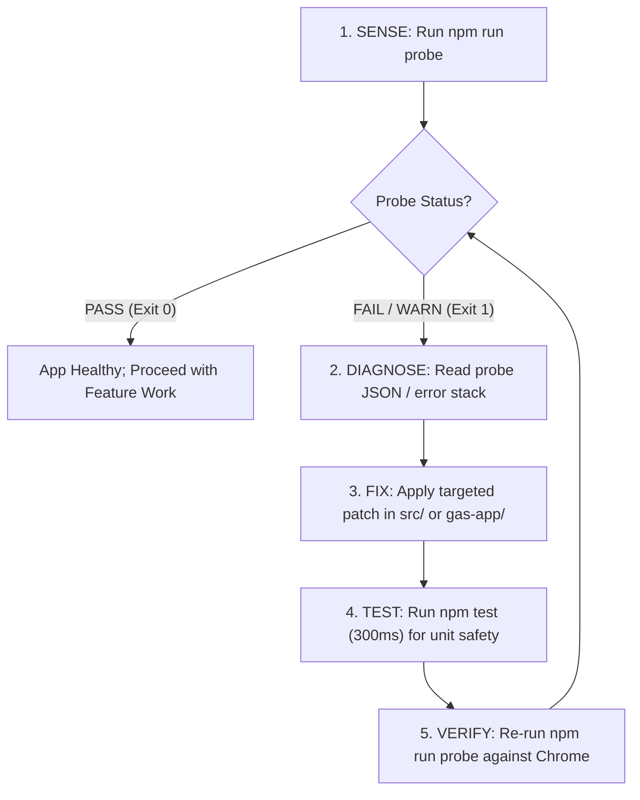

# Probe Live Skill (`probe-live`)

Lightweight, automated health check and diagnostic probe for the live Day Planner Chrome instance via Chrome DevTools Protocol (CDP). Replaces heavyweight test orchestrators with a streamlined **sense → diagnose → fix → test** loop tailored for Google Apps Script.

---

## Capabilities & Usage

Powered by [**`tools/probe-live.js`**](file:///home/mike/projects/day-planner/tools/probe-live.js):

```bash
# 1. Human-readable diagnostic output
npm run probe
# or: node tools/probe-live.js

# 2. Machine-readable JSON output for autonomous models and subagents
node tools/probe-live.js --json

# 3. Listen for transient console errors during probe (default 2s)
node tools/probe-live.js --tail 5

# 4. Custom CDP port (defaults to 9222 or process.env.CDP_PORT)
node tools/probe-live.js --port 9222
```

---

## Health Checks Performed

1. **CDP Reachability**: Verifies port 9222 responds. If inactive, advises running [`tools/ensure-chrome.js`](file:///home/mike/projects/day-planner/tools/ensure-chrome.js).
2. **Tab Presence & Activation**: Identifies the Day Planner tab and activates it (`Target.activateTarget`) to prevent Chrome background timer throttling from freezing execution.
3. **Deployment / Auth State**: Detects Google Drive error pages (e.g. 404 "Page Not Found", auth token expiration, or cross-account access denial).
4. **App & Framework State**:
   - Inspects `#userHtmlFrame` (in GAS) or top window (in local dev).
   - Verifies Alpine.js and `plannerApp` instance initialization.
   - Extracts active view (`daily`, `master-tasks`, `monthly-calendar`, `monthly-index`, `future-matrix`).
   - Counts daily tasks, master tasks, and note cards.
   - Verifies key UI structures (header, navigation tabs, cards container).
5. **Console Error Sniffing**: Captures unhandled runtime exceptions and `console.error` logs in real time.

---

## Autonomous Sense → Diagnose → Fix → Test Workflow

When debugging or implementing features, execute this loop:



### 1. SENSE
Run `node tools/probe-live.js --json` to capture the current state and any console errors.

### 2. DIAGNOSE
Analyze the returned JSON:
- If `status === "FAIL"` and `outerPage.title === "Page Not Found"`: Session expired or invalid deployment URL.
- If `errors` array has entries: Inspect the exact stack trace and file/line references.
- If `checks.appState.loaded === false`: DOM structure or iframe security barrier.

### 3. FIX
Apply minimal, focused code adjustments to [`src/app.js`](file:///home/mike/projects/day-planner/src/app.js) or [`gas-app/Code.gs`](file:///home/mike/projects/day-planner/gas-app/Code.gs).

### 4. TEST & VERIFY
- Fast regression check: `npm test` (executes all 152 unit/integration tests in ~300ms).
- Live browser verification: `npm run probe` to confirm the fix succeeded in the running Chrome tab with 0 runtime errors.
