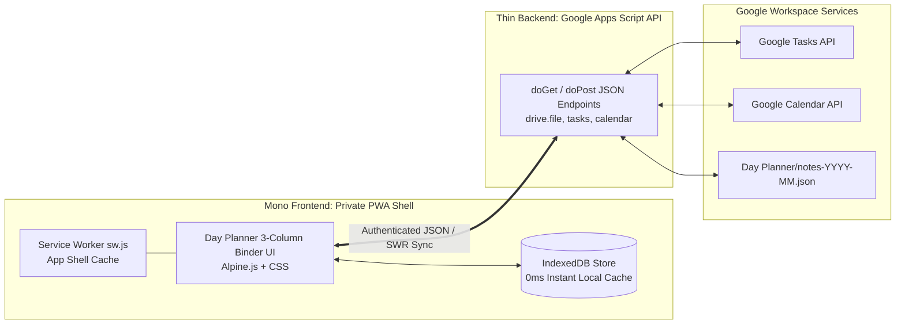
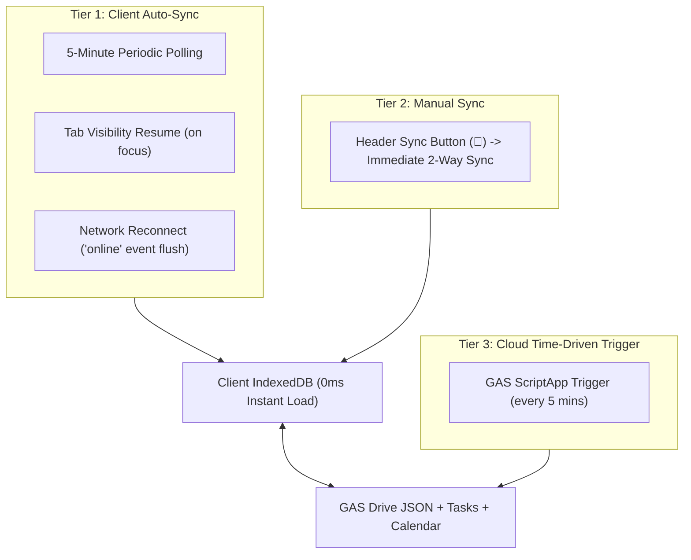

# Day Planner: Hosting Options & Architecture Guide

## 1. Headless Mono-Architecture Overview

To achieve a true **D.R.Y. (Don't Repeat Yourself)** codebase, Day Planner adopts a decoupled **Headless Mono-Architecture**:

- **Frontend (PWA Shell)**: Static SPA (`index.html`, `sw.js`, `manifest.json`, `src/`) hosted on an enterprise web origin. Provides 100% native Service Worker support, instant 0ms startup from local IndexedDB, and PWA installation.
- **Backend (GAS Sync Bridge)**: Lightweight Google Apps Script endpoint (`doGet`/`doPost`) managing Google Tasks, Google Calendar, and monthly notes stored as JSON (`Day Planner/notes-YYYY-MM.json`) under least-privilege `drive.file` scope.

---

## 2. Least-Privilege OAuth Scopes & Storage Strategy

### Google OAuth Scopes

| Scope | Permission Level | Google Consent Description |
| :--- | :--- | :--- |
| `https://www.googleapis.com/auth/drive.file` | 🟢 Sandboxed | *"See, create, and edit only the Google Drive files that you use with this app"* |
| `https://www.googleapis.com/auth/tasks` | 🟢 Scoped | *"Create, edit, organize, and delete all your tasks"* |
| `https://www.googleapis.com/auth/calendar` | 🟢 Scoped | *"See, edit, share, and permanently delete all the calendars you can access"* |
| `https://www.googleapis.com/auth/script.scriptapp` | 🟢 Scoped | Automated time-driven background sync triggers |

> [!NOTE]
> Broad, unrestricted scopes (`auth/drive` and `auth/documents`) are **permanently removed**, eliminating full-drive access warnings and `DocumentApp` sandbox iframe crashes.

### Storage Comparison: Drive JSON vs. GAS Native Storage

- **GAS `PropertiesService`**: Hard limits of **9 KB per key** and **500 KB total project ceiling** make it unsuitable for rich daily note cards. Used only for configuration (folder IDs, sync timestamps).
- **Google Drive Monthly JSON (`Day Planner/notes-YYYY-MM.json`)**: Partitioned monthly, fast (<2ms JSON parse), built-in Google Drive version history, and no quota bottlenecks under `drive.file`.

---

## 3. Hosting & Access Control Options Matrix

| Platform | Privacy & Access Control | Cost | Service Worker (`sw.js`) | Best Use Case |
| :--- | :--- | :--- | :--- | :--- |
| **GSA Enterprise GitHub Pages** | 🔒 **Private / Invitation-Only** (SSO / repo collaborators) | Included with GSA Enterprise | 🟢 100% Native | **Enterprise / Government work** |
| **Cloudflare Pages + Access** | 🔒 **Email Whitelist / Google Auth** (Zero Trust) | Free (up to 50 users) | 🟢 100% Native | Personal / Freelance / Small team |
| **Firebase Hosting** | 🔒 **Google Identity Whitelist** | Free Tier | 🟢 100% Native | Pure Google Cloud stack |
| **Localhost / Tailscale** | 🔒 **Private Local Network / VPN** | Free | 🟢 100% Native | Air-gapped / Local-only |
| **Direct GAS Web App** | 🟡 Google Account auth | Free | 🔴 *Unsupported* (iframe blocks SW) | Simple single-file demo |

---

## 4. Deploying to GSA Enterprise GitHub Private Pages

On a GSA Enterprise (`gsa.gov`) GitHub account, **GitHub Pages Access Control** is natively supported:

1. **Repository Visibility**: Keep the repository **Private** under your GSA organization.
2. **Enable Private Pages**:
   - Navigate to **Settings** $\to$ **Pages**.
   - Under **Build and deployment**, select **Deploy from a branch** (`master` / root).
   - Under **Pages visibility**, select **Private** *(Restricted to people with access to this repository)*.
3. **Manage User Invitations**:
   - Go to **Settings** $\to$ **Collaborators and teams**.
   - Grant **Read** access to invited team members.
   - Unauthorized internet visitors receive a `404 Not Found` / Access Denied.
4. **PWA Installation**:
   - Invited users log in via enterprise SSO.
   - The Service Worker (`sw.js`) registers and pre-caches the application shell for offline use on desktop, tablet, and mobile.

---

## 5. Offline-First & Multi-Tier Synchronization

1. **0ms Instant Startup**: UI renders immediately from local `IndexedDB` on load.
2. **Stale-While-Revalidate (SWR)**: Client checks for cloud updates in the background.
3. **Offline Outbox**: Edits made while offline are queued in `IndexedDB` and auto-flushed when connection resumes.
4. **Automated 5-Minute Polling**: Keeps Tasks and Calendar synced silently while the tab is open.
