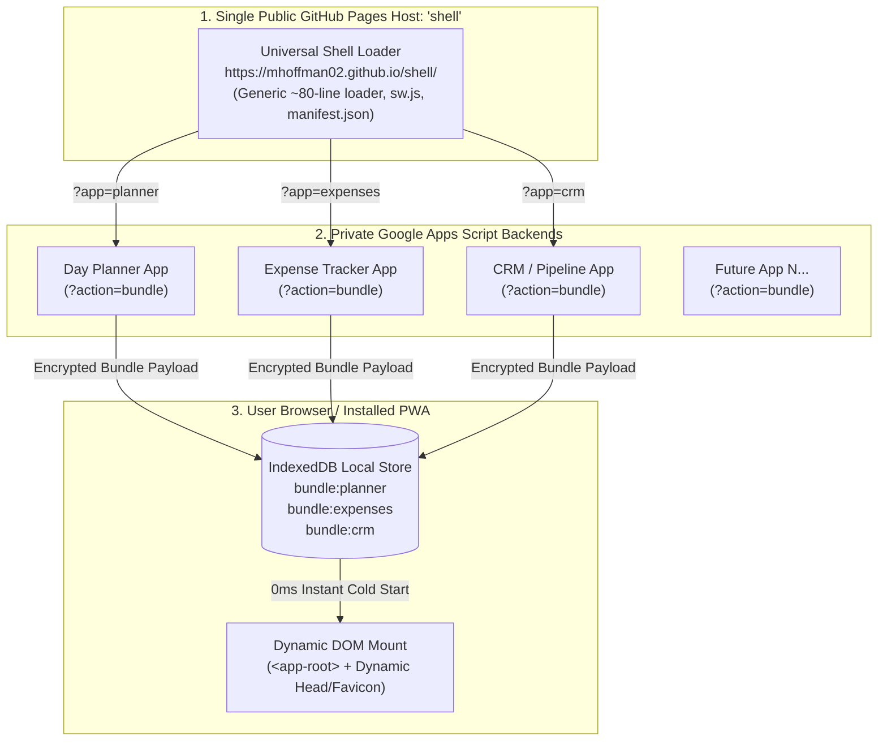

# 🐚 Universal PWA Shell + Private GAS Architecture Pattern

## 1. Executive Summary

The **Universal PWA Shell + Private GAS Pattern** is an architectural framework designed for solo developers and teams who want to build and deploy rich, offline-first Progressive Web Apps (PWAs) using **Google Apps Script (GAS)** as a private cloud backend while leveraging **free GitHub Pages hosting**—all **without exposing any proprietary source code, templates, or business logic publicly**.

A single, generic public repository (e.g. `https://github.com/mhoffman02/shell`) acts as a **Universal Micro-Frontend Shell** that can launch, offline-cache, and hot-update **any number of private Google Apps Script applications**.

---

## 2. Architecture & Data Flow



---

## 3. Core Architectural Advantages

| Feature | How It Works | Developer Advantage |
| :--- | :--- | :--- |
| 🔒 **100% Code Privacy & Zero IP Leakage** | The public GitHub Pages repository contains only a ~80-line generic JavaScript loader and Service Worker. | Full source code, Day Planner/Alpine UI templates, styles, and business logic remain strictly inside your private Google account. |
| ✈️ **0ms Offline Cold Start (Airplane Mode)** | Once fetched, the shell compiles and persists the application bundle into browser `IndexedDB`. | The PWA opens instantly with zero latency even with Wi-Fi disabled or in remote offline environments. |
| 🔄 **1 Shell for Infinite Apps** | The shell routes dynamically using query parameters (`?app=<app-id>`) or a launcher dashboard. | You **never need to create, configure, or manage another GitHub Pages repo** for future Apps Script tools. |
| ⚡ **Hot Updates & Bandwidth Savings** | Shell sends client MD5/SHA hash (`?action=bundle&clientHash=...`). If unchanged, GAS returns `304 Not Modified`. | Fast network checks with zero data waste; updates are applied seamlessly without reinstalling the PWA. |
| 📲 **Native PWA Home Screen Install** | Supported across iOS Safari, Android Chrome, MacOS, Windows, and Linux. | Provides standalone window framing, custom icons, and app switcher integration. |

---

## 4. Multi-Tenant Routing & Storage Model

### A. Routing Strategies
Users can access individual apps via direct URL parameters or through an interactive dashboard:

- **Direct URL Route**: `https://mhoffman02.github.io/shell/?app=planner`
- **Second App Route**: `https://mhoffman02.github.io/shell/?app=expenses`
- **Default App Portal**: `https://mhoffman02.github.io/shell/` *(renders a clean visual launcher of all configured tools)*

### B. Partitioned Client Storage
The shell isolates configurations and cached bundles per application key:

| Storage Type | Key Format | Value Description |
| :--- | :--- | :--- |
| `localStorage` | `gas_url_{appId}` | Deployed Google Apps Script `/exec` Web App URL |
| `IndexedDB` (`bundles` store) | `bundle:{appId}` | Stored JSON bundle: `{ version, hash, timestamp, bundle: { title, html, css, js } }` |

---

## 5. Standardized GAS Backend Contract

Every private Google Apps Script project only needs to implement a standardized ~25-line bundle endpoint handler inside its `Code.gs`:

```javascript
/**
 * Standard Bundle Exporter for Universal PWA Shell
 */
function doGet(e) {
  // 1. Check if request originates from the PWA Shell Loader
  var isBundleRequest = e && e.parameter && (e.parameter.action === 'bundle' || e.parameter.view === 'bundle');
  
  if (isBundleRequest) {
    var clientHash = e.parameter.clientHash;
    var bundleData = getCompiledAppBundle();

    // 304 Cache Validation - Return empty payload if client hash matches
    if (clientHash && clientHash === bundleData.hash) {
      return ContentService.createTextOutput(JSON.stringify({
        status: 'not_modified',
        version: bundleData.version,
        hash: bundleData.hash,
        timestamp: bundleData.timestamp
      })).setMimeType(ContentService.MimeType.JSON);
    }

    // Return full application bundle
    return ContentService.createTextOutput(JSON.stringify({
      status: 'ok',
      version: bundleData.version,
      hash: bundleData.hash,
      timestamp: bundleData.timestamp,
      bundle: bundleData.bundle
    })).setMimeType(ContentService.MimeType.JSON);
  }

  // 2. Default browser fallback when accessed directly
  return HtmlService.createTemplateFromFile('Index')
    .evaluate()
    .setTitle('My Private App')
    .setXFrameOptionsMode(HtmlService.XFrameOptionsMode.ALLOWALL);
}

/**
 * Helper to aggregate HTML, CSS, and JS components
 */
function getCompiledAppBundle() {
  var htmlContent = HtmlService.createHtmlOutputFromFile('Index').getContent();
  var cssContent = HtmlService.createHtmlOutputFromFile('Styles').getContent();
  var jsContent = HtmlService.createHtmlOutputFromFile('Script').getContent();

  var combinedSource = htmlContent + cssContent + jsContent;
  var contentHash = Utilities.base64Encode(
    Utilities.computeDigest(Utilities.DigestAlgorithm.MD5, combinedSource, Utilities.Charset.UTF_8)
  );

  return {
    version: '1.0.0',
    hash: contentHash,
    timestamp: new Date().toISOString(),
    bundle: {
      title: 'My App Name',
      themeColor: '#2d6a5a',
      html: htmlContent,
      css: cssContent,
      js: jsContent
    }
  };
}
```

---

## 6. Universal Shell Client Implementation

The public shell consists of four lightweight, generic files:

```
shell/
├── index.html       # Dynamic mount root (<app-root>) and loader UI
├── pwa.js           # Multi-tenant IndexedDB bundle manager & hot-updater
├── styles.css       # Clean minimal loading splash & app switcher styles
├── sw.js            # Standard offline service worker
└── manifest.json    # Base PWA web app manifest
```

### Dynamic DOM Mounting Flow:
1. **Detect Target App**: Parse `?app=` query parameter from current URL (e.g. `const appId = new URLSearchParams(location.search).get('app') || 'default'`).
2. **Instant Offline Render**: Read `bundle:{appId}` from `IndexedDB`. If present:
   - Update `<title>` and `<meta name="theme-color">`.
   - Inject `<style id="app-styles">` into `<head>`.
   - Mount HTML template into `<div id="app-root">`.
   - Execute client scripts.
3. **Background SWR Hot-Update**: If online, dispatch non-blocking fetch to the stored GAS endpoint with `&clientHash=...`.
4. **Live Hot Swap**: If new hash received, update `IndexedDB` and notify user via subtle toast notification: *"App updated. Click to refresh."*

---

## 7. How to Deploy the Universal Shell

### Step 1: Create the Public Shell Repository
1. On GitHub, create a new public repository: **`shell`** (or `gas-shell`).
2. Copy the contents of `gh-pwa-shell/` into this repository.
3. Push to `main`.

### Step 2: Enable GitHub Pages
1. Go to **Settings** $\to$ **Pages** in the `shell` repository.
2. Select **Source: Deploy from a branch** $\to$ **Branch: `main`** $\to$ **Folder: `/ (root)`**.
3. Click **Save**. The live URL will be active at:  
   `https://<your-username>.github.io/shell/`

### Step 3: Connect Any Private GAS Project
1. In your private project (e.g., `day-planner`), deploy your Web App in Apps Script (`Deploy -> New Deployment -> Web App`).
2. Copy the Web App URL (`https://script.google.com/macros/s/.../exec`).
3. Open `https://<your-username>.github.io/shell/?app=day-planner` in your browser.
4. Paste the Web App URL when prompted on first launch.
5. **Done!** The app is now cached offline and fully installable on desktop and mobile.

---

## 8. Summary Checklist for Adding New Apps

Whenever you build a new private Google Apps Script tool:

- [ ] **1.** Add `getCompiledAppBundle()` and bundle handler in `Code.gs`.
- [ ] **2.** Deploy as Web App in Google Apps Script and copy `/exec` URL.
- [ ] **3.** Launch `https://<your-username>.github.io/shell/?app=<new-app-name>`.
- [ ] **4.** Enter Web App URL on first prompt.
- [ ] **5.** Click **Install PWA** or add to Home Screen.

---

## 9. Known Platform Constraint: GAS Cross-Origin Loading Failures

> **This section documents why direct cross-origin bundle fetching from GitHub Pages to GAS is not possible, and what the correct solution is.**

### Failed Approaches (Do Not Retry)

| # | Strategy | Error | Root Cause |
|---|----------|-------|------------|
| 1 | `<iframe src="gasUrl">` | Infinite redirect loop | Chromium Tracking Prevention blocks 3rd-party Google auth cookies in embedded frames |
| 2 | `fetch('gasUrl?action=bundle')` | `CORS policy: No 'Access-Control-Allow-Origin'` + `ERR_FAILED 302` | GAS edge gateway issues a 302→`accounts.google.com` redirect *before* `doGet()` runs — CORS headers are never set |
| 3 | JSONP `<script src="gasUrl&callback=cb">` | HTTP 401 before callback fires | Same 302 auth redirect gate intercepts the `<script>` request before GAS code executes |
| 4 | GAS Deployment reconfiguration | 401/login redirect persists | Google Workspace account/org policy enforces auth regardless of deployment access settings |

**Root cause:** Google's infrastructure issues the HTTP 302 auth redirect at the network edge, before the Apps Script runtime (`doGet()`) ever executes. No `ContentService.setHeader()` call can set CORS headers on a 302 redirect response.

### Correct Solution: BUILTIN_BUNDLES Embedded in pwa.js

Instead of fetching the bundle at runtime, **pre-compile and embed** it directly inside `pwa.js` as a JavaScript constant:

```javascript
// gh-pwa-shell/pwa.js
const BUILTIN_BUNDLES = {
  'day-planner': {
    version: '1.3.0',
    hash: '...',
    timestamp: '...',
    bundle: { title, themeColor, styles, html, script }
  }
};
```

**`initPWA()` boot router (3-step priority):**

```
Step A: IndexedDB empty?
  → Load from BUILTIN_BUNDLES → persist to IndexedDB → mountBundle() instantly ✅

Step B: IndexedDB has bundle?
  → mountBundle() instantly
  → Background SWR: if gasUrl set & online, fetch update silently (ignore CORS errors)

Step C: No bundle anywhere?
  → Show "Connect Application" setup card
```

**Repo:** `mhoffman02/shell` | **Fix commit:** `3686a8b`

### If Live 2-Way GAS Sync Is Required

For real-time data sync with Google Workspace APIs, the correct approach is **not** cross-origin bundle fetching. Use one of:

1. **OAuth 2.0 PKCE flow** — user authenticates via a Google popup, token stored in IndexedDB, API calls use the access token directly from the client.
2. **Standalone GAS deployment** — serve the entire app directly from `script.google.com/macros/s/.../exec` (no GitHub Pages shell needed for that app).
