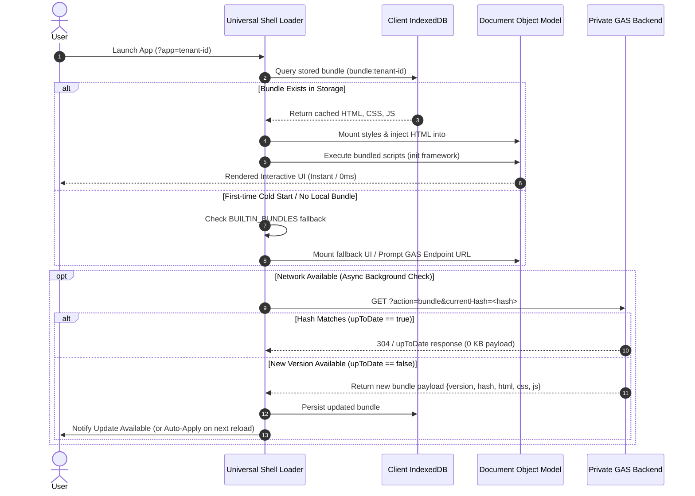

# Theory of Operations: Universal PWA Shell & GAS Backend

## 1. Architectural Motivation & Overview

Traditional Google Apps Script (GAS) web applications run inside sandboxed iframes (`n-xxx.googleusercontent.com`), which breaks key modern web platform capabilities:
- **No Service Worker / PWA support**: Sandboxed iframes cannot register persistent Service Workers or provide native OS installation prompts.
- **High Latency Cold Starts**: Every page view incurs standard GAS cold-start spin-up times.
- **Zero Offline Capability**: Iframed apps require active connectivity on every navigation.

The **Universal PWA Shell + Private GAS Architecture** decouples the **Public Application Container (Shell)** from the **Private Business Logic & UI Payload (Backend)**.

```mermaid
flowchart TD
  subgraph PublicContainer [1. Public Static Origin (e.g., GitHub Pages)]
    SW["Service Worker (sw.js)<br/>Pre-caches Container Assets"]
    Loader["Universal Shell Loader (index.html, pwa.js)<br/>Generic Runtime Engine"]
  end

  subgraph ClientRuntime [2. Client Device (Browser / Installed PWA)]
    IDB[("IndexedDB Local Store<br/>Key: bundle:{appId}")]
    DOM["Virtual & Live DOM<br/>Dynamic Style, Markup, & Script Injection"]
  end

  subgraph PrivateBackend [3. Cloud Backend (Google Apps Script)]
    GAS["Web App Endpoint (?action=bundle)<br/>Compiles HTML/CSS/JS + Hash"]
    CloudStorage[("Cloud Services<br/>Drive, Sheets, Workspace APIs")]
  end

  Loader -->|1. Read Cached Bundle| IDB
  IDB -->|2. 0ms Instant Mount| DOM
  Loader -.->|3. Background Hash Check| GAS
  GAS -.->|4. Delta Bundle Update| IDB
  DOM <-->|5. Authenticated Data API| CloudStorage
```

---

## 2. The Universal Shell Container Model

The public shell is a minimal, static single-page container consisting of four lightweight assets:
1. `index.html`: Shell framing, viewport metadata, app mounting point (`<div id="app-root">`), and fallback UI.
2. `manifest.json`: Web App Manifest defining installation metadata, theme colors, and display modes (`standalone`).
3. `sw.js`: Service Worker caching static shell files for offline resilience.
4. `pwa.js`: Core runtime orchestrator handling multi-tenant routing, storage hydration, bundle mounting, and background synchronization.

### Container Responsibilities
- **Host Agnostic**: Can be served from any static web host (GitHub Pages, Cloudflare Pages, S3, Netlify).
- **Zero Business Logic**: Contains no proprietary code, corporate data, or domain-specific templates.
- **Tenant Isolation**: Isolates application state, cached bundles, and configuration keys per application identifier.

---

## 3. Storage & Execution Lifecycle



### Dynamic DOM Mounting Flow
When a bundle is mounted into the container:
1. **Style Injection**: Replaces or updates the dynamic `<style id="app-bundle-styles">` tag in `<head>`.
2. **Markup Injection**: Sets the sanitized HTML content into `<div id="app-root">`.
3. **Script Lifecycle**: Injects the application script tag, binding reactivity engines (e.g., Alpine.js, Vue, or Vanilla JS) to the newly populated DOM nodes.
4. **Metadata Alignment**: Updates document title, theme meta tags, and favicon dynamically to reflect the active tenant app.

---

## 4. Backend API Contract (`?action=bundle`)

The backend Google Apps Script project exposes an endpoint that packages client assets into a single JSON payload.

### Request Format
```http
GET https://script.google.com/macros/s/{DEPLOYMENT_ID}/exec?action=bundle&currentHash={CLIENT_HASH}&callback={JSONP_FUNC}
```

### Response Payloads

**When bundle is unchanged:**
```json
{
  "upToDate": true,
  "version": "1.3.0",
  "hash": "d41d8cd98f00b204e9800998ecf8427e",
  "timestamp": "2026-08-17T17:00:00.000Z"
}
```

**When an update is delivered:**
```json
{
  "upToDate": false,
  "version": "1.3.0",
  "hash": "d41d8cd98f00b204e9800998ecf8427e",
  "timestamp": "2026-08-17T17:00:00.000Z",
  "bundle": {
    "title": "Tenant Application Title",
    "themeColor": "#2d6a5a",
    "styles": "/* Compiled CSS */",
    "html": "<!-- Compiled DOM Markup -->",
    "script": "/* Compiled Client JS */"
  }
}
```

---

## 5. Multi-Tenant Application Routing

A single deployed Universal Shell can host an arbitrary number of independent applications using query-parameter routing:

| Route Pattern | Target Tenant | Storage Key |
| :--- | :--- | :--- |
| `https://host/shell/?app=alpha` | Application Alpha | `bundle:alpha` |
| `https://host/shell/?app=beta` | Application Beta | `bundle:beta` |
| `https://host/shell/` | Tenant Launcher Portal | `registry:apps` |

- **State Isolation**: Each application's IndexedDB records, offline outboxes, and LocalStorage keys are namespaced by the app ID.
- **Manifest Scope**: The PWA manifest covers the shell root, allowing installed apps to launch straight into the designated tenant via shortcut parameters.

---

## 6. Security, Privacy & Compliance Model

1. **Zero Intellectual Property on Public Static Hosts**:
   - The public repository host only serves the generic loader engine.
   - All business logic, proprietary HTML templates, and backend code stay protected inside private cloud infrastructure.
2. **Least-Privilege Authorization**:
   - Data requests interact with the backend via user-authenticated Google OAuth sessions or structured API tokens.
3. **Integrity Verification**:
   - Bundle hashes (MD5/SHA-256) validate payloads before execution, preventing injection or incomplete asset hydration.
4. **Offline Data Boundary**:
   - Encrypted/sanitized local storage retains only required user workspace data, isolating private caches to the client device.
